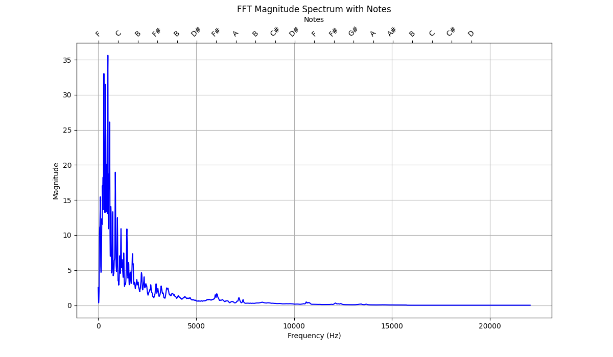

# Music Key Detector


## Key Detection from Audio

This Python script is an **exercise** in audio key detection. It analyzes an audio file (in `.wav` or `.mp3` format) to detect its musical key. The script utilizes the Fast Fourier Transform (FFT) to generate pitch class profiles (PCPs) and matches them against predefined major, minor, and modal scale profiles. **This tool is not intended for analyzing complex or "real" music featuring multiple instruments, dense mixes, or noisy recordings. It was created to test the capabilities of the OpenAI o1 model.**

### Features

- Detects the key and mode (e.g., Dorian, Phrygian) of an audio file.
- Supports `.wav` and `.mp3` audio formats.
- Computes pitch class profiles based on frequency data.
- Visualizes the FFT magnitude spectrum with an optional plot.
- Leverages Pandas and NumPy for efficient data manipulation.

### Requirements

The script requires the following Python libraries:

- `numpy`
- `pandas`
- `scipy`
- `pydub`
- `matplotlib`

### Installation

1. Clone the repository:
   ```
   git clone <repository_url>
   cd <repository_name>
   ```

2. Install the required dependencies:
   ```
   pip install -r requirements.txt
   ```

3. Ensure you have `ffmpeg` installed for audio format conversion (required by `pydub`):
   ```
   sudo apt install ffmpeg  # On Ubuntu/Debian
   brew install ffmpeg      # On macOS
   ```

### Unit Tests

The project includes a basic test suite to validate the key detection algorithm. However, **some tests fail due to the simplicity of the method and its limited accuracy for more nuanced keys and modes.** Specifically, it struggles with modes like Phrygian and Locrian.

To run the tests:

```bash
python3 -m unittest test_music_key_detector.py
```

#### Example Output:
```plaintext
FF
======================================================================
FAIL: test_keys (test_music_key_detection.TestMusicKeyDetector.test_keys) (key='C_Phrygian.wav')
Test key detection for keys.
----------------------------------------------------------------------
Traceback (most recent call last):
  File "/path/to/test_music_key_detection.py", line 73, in test_keys
    self.assertEqual(
AssertionError: 'Detected Key: C Natural Minor' != 'Detected Key: C Phrygian'
- Detected Key: C Natural Minor
+ Detected Key: C Phrygian
 : Output for C_Phrygian.wav was Detected Key: C Natural Minor, expected Detected Key: C Phrygian.

======================================================================
FAIL: test_keys (test_music_key_detection.TestMusicKeyDetector.test_keys) (key='C_Locrian.wav')
Test key detection for keys.
----------------------------------------------------------------------
Traceback (most recent call last):
  File "/path/to/test_music_key_detection.py", line 73, in test_keys
    self.assertEqual(
AssertionError: 'Detected Key: D# Melodic Minor' != 'Detected Key: C Locrian'
- Detected Key: D# Melodic Minor
+ Detected Key: C Locrian
 : Output for C_Locrian.wav was Detected Key: D# Melodic Minor, expected Detected Key: C Locrian.

----------------------------------------------------------------------
Ran 2 tests in 16.765s
```

These failures underscore the **educational and experimental** nature of the project.

### Usage

Run the script with an audio file and optional arguments:

```
python script.py <audio_file> [--plot <path>] [--show-scores]
```

By default the script will display a plot like this:



#### Command-Line Options:

- `<audio_file>`: Required. Path to the input audio file (e.g., `song.mp3`).
- `--plot <path>`: Optional. Save the FFT plot as an image (e.g., `spectrum.png`).
- `--show-scores`: Optional. Display scores for all possible keys and modes.

#### Examples:

- Basic key detection:
  ```bash
  python script.py audio.wav
  ```

- Save FFT plot:
  ```bash
  python script.py song.mp3 --plot spectrum.png
  ```

- Show key and mode scores:
  ```bash
  python script.py song.mp3 --show-scores
  ```

- Combined:
  ```bash
  python script.py song.mp3 --plot spectrum.png --show-scores
  ```

### Notes

- This project is an **educational tool** and is not suitable for professional music analysis.
- For best results, use audio files with single instruments or clear melodies.

---

### License

This project is licensed under the MIT License. See the `LICENSE` file for details.

### Author

Developed collaboratively by Manuel Rueda and AI assistance (ChatGPT).
